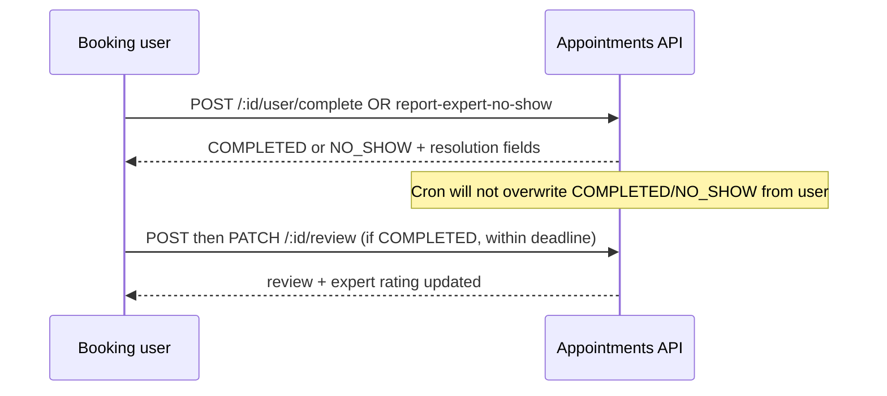

# Frontend guide — user session completion, no-show report & reviews

Scope: **only** the behavior added or changed per [`PLAN_user_session_complete_and_reviews.md`](./PLAN_user_session_complete_and_reviews.md).  
Full booking/Jitsi flow remains in [`FRONTEND_BOOKING.md`](./FRONTEND_BOOKING.md).

---

## Base URL & auth

| Item       | Value                                              |
| ---------- | -------------------------------------------------- |
| **Prefix** | `{ORIGIN}/api/v1/appointments`                     |
| **Auth**   | `Authorization: Bearer <JWT>` on every route below |
| **`:id`**  | Numeric appointment id                             |

---

## New fields on `Appointment` (JSON)

Use these from list/detail responses (`my-appointments`, expert lists, or any handler returning `appointment`).

| Field                   | Type                                        | Meaning                                                                                                                                                                                         |
| ----------------------- | ------------------------------------------- | ----------------------------------------------------------------------------------------------------------------------------------------------------------------------------------------------- |
| `userSessionResolvedAt` | ISO string or `null`                        | Set when the **booking user** resolves via `POST .../user/complete` or `POST .../user/report-expert-no-show`. Not set by cron; admin/expert PATCH complete may leave it `null` until user acts. |
| `resolutionSource`      | `"USER"` \| `"CRON"` \| `"ADMIN"` \| `null` | How the row first reached a terminal status (nullable until terminal).                                                                                                                          |
| `resolvedByUserAction`  | boolean                                     | `true` only when resolution came from the **user** no-show/complete APIs.                                                                                                                       |

**Reviews** are a separate resource; fetch via your own `GET` if you add one later, or after `POST`/`PATCH` review responses (body includes `review`).

---

## Concepts the UI must enforce

### User-defined terminal locking

For **`COMPLETED`** and **`NO_SHOW`**, the booking user APIs below **must not** be used to “switch” outcome:

| Current status                   | `POST .../user/complete`               | `POST .../user/report-expert-no-show` |
| -------------------------------- | -------------------------------------- | ------------------------------------- |
| `COMPLETED`                      | **200** `unchanged: true` + `earnings` | **409** — cannot report no-show       |
| `NO_SHOW`                        | **409** — cannot complete              | **200** `unchanged: true`             |
| `SCHEDULED` / `IN_PROGRESS`      | Allowed (if gates pass)                | Allowed (if gates pass)               |
| Other (`FAILED`, `CANCELLED`, …) | **400**                                | **400**                               |

Comment in product copy: terminal outcomes stay fixed for data integrity.

### Time gates (booking user only)

| Action                    | Rule                                                                                                 |
| ------------------------- | ---------------------------------------------------------------------------------------------------- |
| **Mark complete**         | `now >= startAt` **and** `now >= startAt + 5 minutes` (server constant `MIN_SESSION_MINUTES = 5`).   |
| **Report expert no-show** | `now >= startAt` **and** `now >= startAt + 5 minutes` (server constant `NO_SHOW_DELAY_MINUTES = 5`). |

Mark complete does **not** require `endAt` to have passed.

### Review window

Server computes:

`deadline = (userSessionResolvedAt ?? updatedAt) + APPOINTMENT_REVIEW_EDIT_WINDOW_HOURS`

- Default **48** hours if env unset/invalid.
- **POST** and **PATCH** review allowed only while `now <= deadline`.
- Reviews only when `status === "COMPLETED"`. **`NO_SHOW`** → **400**, not idempotent success.

**Frontend:** optionally show a countdown using the same formula if you expose `userSessionResolvedAt`, `updatedAt`, and the configured window (or call a small backend helper later).

---

## End-to-end flow (what happens)

1. Session is **`SCHEDULED`** or **`IN_PROGRESS`** (existing Jitsi join/heartbeat/leave unchanged).
2. **Booking user** either:
   - **`POST .../user/complete`** → **`COMPLETED`** + expert earnings + `resolutionSource: USER`, `resolvedByUserAction: true`, `userSessionResolvedAt` set (first time).
   - **`POST .../user/report-expert-no-show`** → **`NO_SHOW`**, no earnings, same USER flags, counters incremented once; or
   - Leaves resolution to **cron / leave evaluation** (overlap rules) → terminal with `resolutionSource: CRON`, `resolvedByUserAction: false`.
3. **Expert or booking user** can still use **`PATCH .../status`** for `SCHEDULED → IN_PROGRESS → COMPLETED` (see changed behavior below).
4. After **`COMPLETED`**, booking user may **`POST .../review`**, then **`PATCH .../review`** until deadline.
5. **Reschedule** (user or admin) clears participation and **`userSessionResolvedAt` / `resolutionSource` / `resolvedByUserAction`**; admin reschedule also removes an existing review and fixes expert aggregates.



---

## APIs to implement

### 1. `POST /:id/user/complete`

**Who:** `appointment.userId` only → else **403**.

**Body:** none required (empty JSON or no body is fine).

**Success — transition to `COMPLETED` (200)**

```json
{
  "appointment": { "...": "full Appointment row" },
  "earnings": {
    "appointmentAmount": 0,
    "platformTax": 0,
    "gstOnTax": 0,
    "afterDeductions": 0,
    "expertEarnings": 0
  }
}
```

**Success — already completed (200)** — no second earnings:

```json
{
  "unchanged": true,
  "appointment": {},
  "earnings": {}
}
```

**Errors**

| Status  | When                                                                                                                                                            |
| ------- | --------------------------------------------------------------------------------------------------------------------------------------------------------------- |
| **400** | Not `SCHEDULED`/`IN_PROGRESS`; or before `startAt`; or before `startAt + 5 min` → `{ "message": "Session must run for at least 5 minutes before completion." }` |
| **401** | No/invalid JWT                                                                                                                                                  |
| **403** | Not the booking user                                                                                                                                            |
| **404** | Unknown id                                                                                                                                                      |
| **409** | Status is `NO_SHOW` → `{ "message": "Session was already closed as no-show." }`                                                                                 |
| **500** | Server error                                                                                                                                                    |

---

### 2. `POST /:id/user/report-expert-no-show`

**Who:** booking user only → else **403**.

**Body:** none required.

**Success — transition to `NO_SHOW` (200)**

```json
{
  "appointment": {}
}
```

**Success — already `NO_SHOW` (200)**

```json
{
  "unchanged": true,
  "appointment": {}
}
```

**Errors**

| Status                      | When                                                                                                                        |
| --------------------------- | --------------------------------------------------------------------------------------------------------------------------- |
| **400**                     | Wrong status; or before `startAt`; or before delay → `{ "message": "Please wait a few minutes before reporting no-show." }` |
| **409**                     | Already `COMPLETED` → `{ "message": "Cannot report no-show on a completed session." }`                                      |
| **401** / **403** / **404** | As above                                                                                                                    |

**Note:** Counters on user/expert increment **once** per appointment on first successful transition; idempotent repeat does **not** increment again.

---

### 3. `POST /:id/review`

**Who:** booking user only.

**Body**

```json
{
  "rating": 1,
  "comment": "optional string, max 2000 chars after trim"
}
```

- `rating`: integer **1–5**, required.
- `comment`: optional; omit, empty string, or trimmed text.

**Success (201)**

```json
{
  "message": "Review submitted",
  "review": {
    "id": 0,
    "appointmentId": 0,
    "userId": 0,
    "expertId": 0,
    "rating": 0,
    "comment": null,
    "createdAt": "",
    "updatedAt": ""
  }
}
```

**Errors**

| Status                      | When                                                                   |
| --------------------------- | ---------------------------------------------------------------------- |
| **400**                     | Not `COMPLETED`; invalid body                                          |
| **403**                     | Past review deadline → `{ "message": "The review period has ended." }` |
| **409**                     | Review already exists → use **PATCH**                                  |
| **401** / **403** / **404** | As usual                                                               |

---

### 4. `PATCH /:id/review`

**Who:** booking user who owns the review.

**Body** (at least one field)

```json
{
  "rating": 5,
  "comment": "optional or null to clear"
}
```

**Success (200)**

```json
{
  "message": "Review updated",
  "review": {}
}
```

**Errors:** **400** validation; **403** deadline; **404** no review; **401** / **403** not owner.

Expert **`rating`** aggregate is recalculated; **`totalReviews`** unchanged on edit.

---

## Changed existing APIs (same paths, new rules or fields)

### `PATCH /:id/status`

- Now requires caller to be **booking user or expert** (**403** otherwise).
- On transition to **`COMPLETED`**:
  - **Booking user:** `resolutionSource: USER`, `resolvedByUserAction: true`, `userSessionResolvedAt` set if was `null`.
  - **Expert:** `resolutionSource: ADMIN`, `resolvedByUserAction: false`.
- Response for `COMPLETED` includes **`earnings`** object (same shape as user complete).

Frontend: prefer **`POST .../user/complete`** for the patient “I’m done” action if you want the **5-minute minimum** rule; **`PATCH .../status`** to `COMPLETED` does **not** apply that minimum (expert can still complete via PATCH without it).

### `PATCH /:id/reschedule`

- Still only **`SCHEDULED`** appointments (user flow).
- Response `appointment` also has **`userSessionResolvedAt`**, **`resolutionSource`**, **`resolvedByUserAction`** cleared with participation fields.

---

## Environment (server)

| Variable                               | Role                                                                                    |
| -------------------------------------- | --------------------------------------------------------------------------------------- |
| `APPOINTMENT_REVIEW_EDIT_WINDOW_HOURS` | Hours after `userSessionResolvedAt ?? updatedAt` for review POST/PATCH. Default **48**. |

Frontend typically does not read this unless you duplicate the deadline in UI; align with product on showing “edit review until …”.

---

## Quick implementation checklist

- [ ] After session UI, offer **“Mark complete”** → `POST .../user/complete` (handle **409** if no-show, **200 unchanged** if already done, **400** with min-duration message).
- [ ] Offer **“Expert didn’t join”** → `POST .../user/report-expert-no-show` (handle delay **400**, **409** if completed).
- [ ] After **`COMPLETED`**, show review form → `POST .../review`, then edit → `PATCH .../review` until deadline (**403** when closed).
- [ ] Display **`resolutionSource` / `resolvedByUserAction`** only if useful for support/debug; optional in normal UX.
- [ ] Do not assume cron will change status once **`COMPLETED`** or **`NO_SHOW`** from user APIs.

---

## Related code (backend)

| Piece                             | Path                                                                                                                                                                                                            |
| --------------------------------- | --------------------------------------------------------------------------------------------------------------------------------------------------------------------------------------------------------------- |
| Routes                            | `src/route/appointment.route.ts`                                                                                                                                                                                |
| Handlers                          | `src/controller/appointment.controller.ts` (`postUserAppointmentComplete`, `postUserReportExpertNoShow`, `postAppointmentReview`, `patchAppointmentReview`, `updateAppointmentStatus`, `rescheduleAppointment`) |
| Constants / deadline              | `src/lib/appointmentUserSession.ts`                                                                                                                                                                             |
| Cron guard + CRON resolution      | `src/lib/appointmentParticipation.ts`                                                                                                                                                                           |
| Admin force-complete resolution   | `src/lib/appointmentForceComplete.ts`                                                                                                                                                                           |
| Admin reschedule + review cleanup | `src/controller/admin.controller.ts` (`adminRescheduleAppointment`)                                                                                                                                             |
